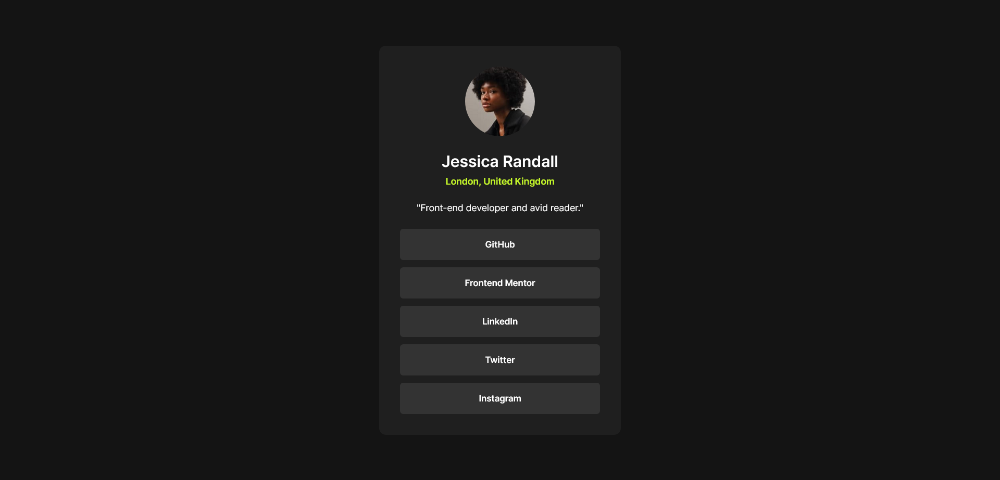

# Frontend Mentor - Social links profile solution

This is a solution to the [Social links profile challenge on Frontend Mentor](https://www.frontendmentor.io/challenges/social-links-profile-UG32l9m6dQ). Frontend Mentor challenges help you improve your coding skills by building realistic projects. 

## The challenge

Users should be able to:

- See hover and focus states for all interactive elements on the page

## Screenshot

## Links

- Solution URL: [Here](https://github.com/hrid-chakraborty/social-links-profile)
- Live Site URL: [Here](https://hrid-chakraborty.github.io/social-links-profile)

